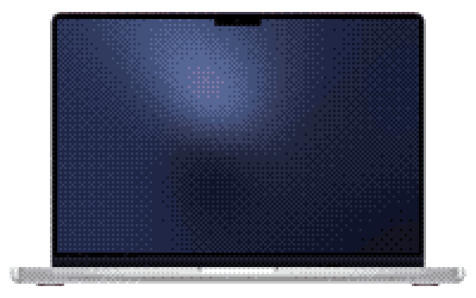

# Ditherglow

An animated, dithered wallpaper for macOS that follows the sun. Soft colour blobs drift across your desktop, rendered as chunky dither pixels, and the palette moves with the real sky outside: day, golden hour, sunset glow, blue hour, moonlight, and back again.

[](docs/macbook.mp4)

## Features

- **Lives behind your desktop icons** on every connected display, and rebuilds itself when screens are plugged in or resolutions change.
- **Daybreak palette** tied to the sun's altitude at your location. Seven named phases (Moonlight, Dusk, Blue Hour, Sunrise & Sunset, Golden Hour, Day, Midday) blend smoothly in OKLab, so mixes stay vivid instead of turning grey.
- **No location permission needed.** Your approximate latitude and longitude come from the system time zone (via a bundled copy of tzdb's `zone.tab`), and sunrise and sunset are computed locally with almanac formulas.
- **Menu bar app** with no Dock icon. The sparkle icon dims when the wallpaper is off.
- **Preview window** with a time-of-day scrubber to see any phase of the sky on demand.
- **Settings** for pixel size (2–16 pt) and drift speed.
- **One Metal shader pass** via SwiftUI: the gradient is evaluated once per dither block, which keeps it cheap enough to run all day.

## Requirements

- macOS 14 Sonoma or later
- Xcode 16 or later to build

## Building

```bash
git clone git@github.com:mstrlc/ditherglow.git
```

```bash
open ditherglow/Ditherglow.xcodeproj
```

Then build and run the **Ditherglow** scheme. The app appears as a sparkle in the menu bar. Turn on **Animated Wallpaper** from there.

## Usage

| Menu item | What it does |
| --- | --- |
| Animated Wallpaper | Toggles the animated sky behind your desktop |
| Show Preview | Opens a window with a scrubber to preview any time of day |
| Settings… (⌘,) | Pixel size and speed |
| Quit Ditherglow (⌘Q) | Quits and restores your normal wallpaper |

## Project layout

```
Ditherglow/
├── DitherglowApp.swift          Menu bar extra, preview window, settings scene
├── ContentView.swift            Preview window with the time-of-day scrubber
├── SettingsView.swift           Pixel size, speed, launch at login and updates
├── macOS/
│   ├── DesktopWindowController.swift   Borderless windows behind the desktop icons
│   ├── Updater.swift            Sparkle updates (Check for Updates…)
│   └── Info.plist               Sparkle feed URL and key
└── Shared/
    ├── Ditherglow.metal         Gradient + ordered dither shader
    ├── DitherglowView.swift     SwiftUI view driving the shader
    ├── Sky.swift                Daybreak palette, keyed by sun altitude
    ├── Sun.swift                Solar altitude, sunrise/sunset, time-zone location
    └── Preferences.swift        UserDefaults keys and defaults
```

## License

Ditherglow is free software, released under the [GNU General Public License v3.0](LICENSE). You may use, study, modify and redistribute it, provided derivative works stay under the same license.
